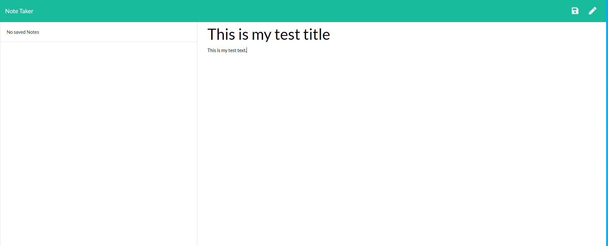
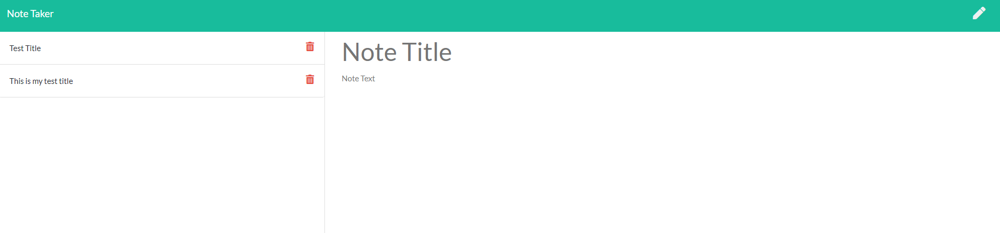

# Notes App
      

## Description
   An application that can be used to write, save, and delete notes - it uses express backend, as well as a JSON file to save and store data. 

## Table of Content
   
* [Installation](#installation)
     
* [Usage](#usage)

* [Future Direction](#Future-Direction)

* [Live Screenshots](#Live-Screenshots)

* [Contributions](#Contributions)
       
* [Credits](#credits)
    
* [License](#license)
     
  

    
  
## Installation
1.  For local deployment - install node, run code "npm i" then "npm start" 
2.  Alternate Method - Click on this [Deployed Link](https://vast-harbor-22173.herokuapp.com/)
  
## Usage
    This application takes in users input; Note title and content for the note. The user can choose to then save this note and it is added to a list of notes displayed on the left side of the application. The user can go on to delete the notes with the delete button.

    The data being inputted by the user is stored in a JSON database, API calls are made to pull that information and display them.  

## Future Direction
* Allowing user to colour code notes.
* Allowing users to pin notes.

### Live Screenshots

### Contributions 

    This application has an MIT license and is completely open to open source contribution! Feel free to fork and enhance the functionality and add features if you would like! 

### Changelog
    Version: 1.0: First Release 
    
## Credits
    N/A
    
## License
     MIT
      
    
## Questions
* Github : [Ezkenneth](github.com/Ezkenneth)
* E-mail : Reach me at - kennethjoeezigbo@gmail.com